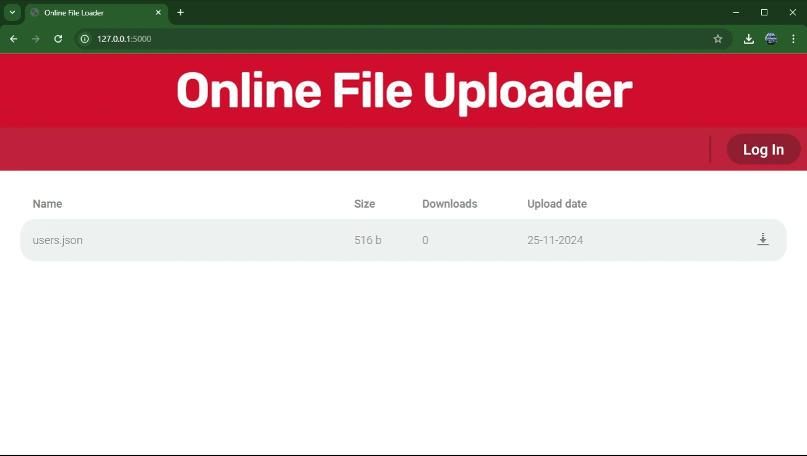
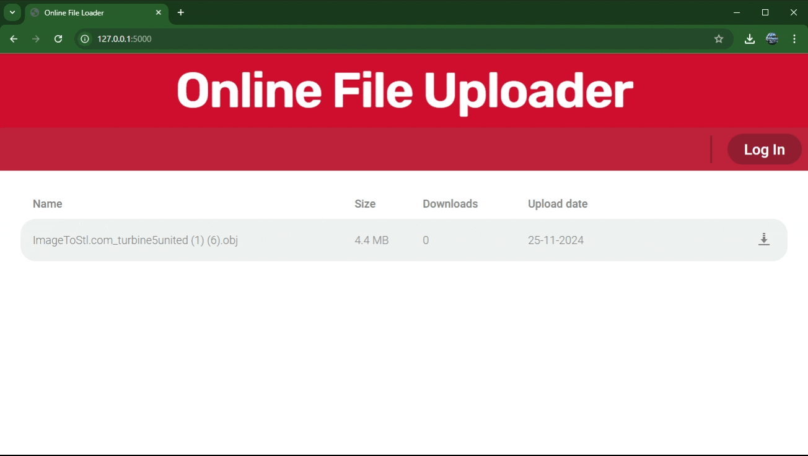

# File Exchanger
## About The Project
The essence of the project is a web application that can download files from the device to the server and vice versa. In addition, project supports the concept of users and administrators as main roles.

### Built With
Languages:
* [](#)
*	[](#)
* [](#)
* 	[](#)

Frameworks:
* [](#)

Databases:
* [](#)

## Getting Started
###Prerequisites
* Flask
  ```sh
  pip install Flask
  ```
* SQLAlchemy
  ```sh
  pip install SQLAlchemy
  ```
* SQLAlchemy for Flask  
  ```sh
  pip install Flask-SQLAlchemy
  ```

###Installation

1. Clone the repository
   ```sh
   git clone https://github.com/DaniilKhortov/file_exchanger_KhortovDP.git
   ```
2. Install libraries
  ```sh
  pip install Flask-SQLAlchemy
  ```
3.Change git remote
  ```sh
  git remote set-url origin https://github.com/DaniilKhortov/file_exchanger_KhortovDP.git
  ```


## Usage
### File download 



### File upload & configuration 


### Authorization & registration



## Project Structure
```bash
< PROJECT ROOT >
   |
   |-- app/
   |    |
   |    | -- models.py                     # Database Tables
   |    | -- routes.py                     # Main functions to work with client
   |    | -- utils.py                      # Helpers to manipulate date, files  
   |    | -- __init__.py                   # Initialization of flask app, connection to database
   |    | -- accountsData.db               # Database
   |    |
   |    |-- static/
   |    |    |-- css/                  
   |    |    |    |
   |    |    |    |-- desktop.css          # Used by pages, provides adaptability of interface to the bigger screens
   |    |    |    |-- reset.css            # Used by pages, sets vasic html-elements parameters to 0
   |    |    |    |-- style.css            # Used by pages, responsible  for design 
   |    |    |-- js/                  
   |    |    |    |
   |    |    |    |-- auth.js              # Responsible for keeping user authorized after closing window
   |    |    |    |-- download.js          # Responsible for downloading files by user and admin
   |    |    |    |-- elementsUtil.js      # Responsible for file upload and configuration by admin
   |    |
   |    |-- templates/
   |    |    |    
   |    |    |-- index.html                # Main page
   |    |    |-- login.html                # Authorization page
   |    |    |-- register.html             # Registration page
   |    |    |-- admin.html                # Modified main page for admin
   |    |    |
   |    |    |
   |    |    |
   |
   |-- run.py                              # Starts the app 
   |
   |-- ************************************************************************
```

